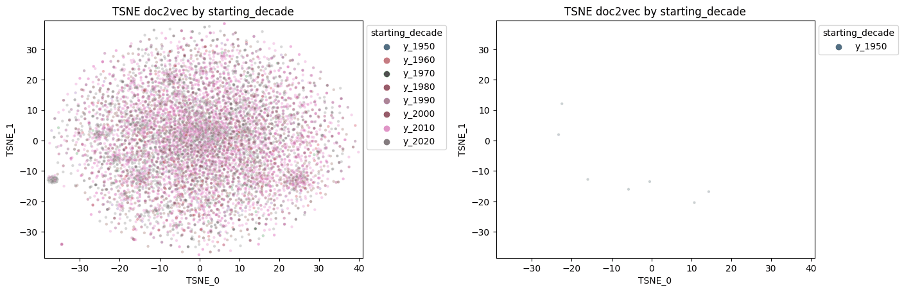

# Art-Driven Manga Recommendations: Bridging Collabortive and Art-Based Filtering

This project introduces a novel recommendation model that combines traditional collaborative and content-based filtering techniques with a unique focus on manga art style analysis through feature extraction with a pretrained image classifcation model. While most manga recommendation models primarily rely on collaborative filtering, this model prioritizes the exploration of manga art styles to enhance the recommendation process.

## Overview

The goals of this project was to create a recommendation system that will (1) implement an art style focused reccomendation, (2) combine collaborative filtering of MAL reviews, (3) leverage ANIList tag and genre scores to support content based filtering

**Skill learned during project:**

1. **Reccomenation Model** Implmentation
   - **Collaborative filtering** with reviews from MAL
   - **Content based filtering** with descriptors, genres, tags, and scores from MAL and ANIlist
2. Feature extraction with **pretrained image model**
   - familiarized myself with the image classificaiton world
   - applied **transfer learning** technique and feature extraction outputs
3. Description processing with **doc2vec** to process manga description to add to content based dataset
4. Data scrapping and API usage
   - have prior expereince in both, but it was good to practice again

## Data Sourcing and Scrapping

There are three main data sources that were pulled from using either the offical API or a scrapping library. The goal was to have these final dataset:

1. Top 15k manga descriptors
   1. From MAL - descriptions, genres, published date, name, demographic
   2. From ANIlist - tags, genres, scores
2. List of scored manga reviews from MAL users
3. Images of Chapter 1 - 5, pages 5-10 from mangadex

**Manga Descriptors**
MAL's API was used first to get a list of the top 15k manga on MAL and the associated descriptors with them (description, score, genre, demographic, date published). Luckily ANIlist also uses MAL manga id as a possible input to their API, so the tags, genres, and scores were pulled from ANIlist's API.

**MAL User Manga List**
Scrape a list of users who most recently reviewd each of the 15k most popular manga. With the list of usernames, their managa list is pulled using MAL's API, ultimatley containing a long formated table of each user's read mangas.

**Manga Images**
Manga images were scrapped from mangadex using a premade library to download managa from the site. First though google was scrapped for the right mangadex link to the manga and was cross check with the assocaited MAL id. Once all the correct managdex links was confrmed, manga pages were selectively downloaded from Chapter 1 - 5, pages 5-10 for each, along with the first cover image.

## Manga Art Style Feature Extraction

SUMMARY

**Processing and Cleaning Images for Model**
something

**Setting up XXX Model for Feature Extraction**
something

**Summarizing Feature Results per Manga**
something

## Manga Content Based Filtering

SUMMARY

**Description Doc2Vec**
something

**Tags, Genres, and Demographic Data**
something

**Score and Popularity**
something

## Conclusion

something

