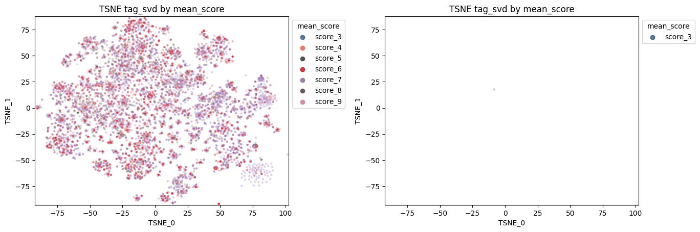

# Manga Recommendation by Art Style

Welcome to the Manga Recommendation by Art Style project repository! This project introduces an innovative recommendation model that seamlessly integrates content-based filtering techniques with a distinctive emphasis on manga art style analysis. The approach involves feature extraction utilizing a pre-trained image classification model. While conventional manga recommendation models predominantly rely on collaborative filtering, our model pioneers the exploration of manga art styles to elevate the recommendation process.

## 1. Overview

The primary objectives of this project were twofold: (1) to compare and recommend manga based on art style and (2) to harness ANIList tags, genre information, and descriptions to fortify content-based filtering.

**Key Skills Acquired During the Project:**

1. **Content based filtering** utilizing descriptors, genres, tags, and scores from MAL and ANIList.
2. Feature extraction employing a  **pretrained image model**
   - Application of **transfer learning** techniques and extraction of feature outputs.
3. Description processing using **doc2vec** to incorporate manga descriptions into the content-based dataset.
4. Data scraping and API utilization - valuable practice.

### 1.1 Manga Art Style Features Analysis

Upon extracting features using the ConvNeXt pretrained model, each manga was distilled into 1647 features based on the first five chapters. As an unsupervised learning task, the similarity between each vector representation was quantified using general demographic and year of release data for comparison. t-SNE was employed to reduce the feature space to two dimensions, resulting in the following visualizations:

#### Art Features vs. Demographic

The graph above illustrates the reduced art feature vectors using t-SNE, color-coded by demographic data for each manga. Despite not being part of the feature extraction models, clear differences in clustering among each demographic type are apparent.

Expected overlaps between Seinen (older men) and Shounen (younger men), as well as between shoujo (younger women) and Josei (older women) are observed. However, the distinct separation of each manga demographic is particularly noteworthy.

#### Art Features vs. Release Date

Similarly, the graph above illustrates the reduced art feature vectors using t-SNE, color-coded by the release decade for each manga. Despite not being fed into the feature extraction models, clear clustering differences among each decade are evident.

Given the time sensitivity associated with each decade, a gradual transition and grouping from older manga pre-2000 on the right-hand side to 2000 and 2010 manga moving toward the center and left are observed. Once again, the effective separation of features for each decade is impressive, relying solely on the image features of each manga.

#### Recommendations

Using select manga from each demographic, here are examples of "similar" manga based on cosine similarity within each demographic.

Noteworthy observations on the pulled manga:

1. "Blue Lock" - Detection of similarities with the spin-off manga "Blue Lock: Episode Nagi" based solely on image data.
2. Virtually all demographics align within the same type as the source manga (Josei, at least, aligns within the gender - Shoujo).
3. Starting Publish Year within +/- one decade.

Overall, the project has yielded surprising results in our ability to differentiate art styles using transfer learning from a pre-trained model.

**Blue Lock** - Shounen

**KaiChou Wa Maid-sama** - Shoujo

**Paradise Kiss** - Josei

**Vinland Saga** - Seinen

[Art Similarity Table](https://github.com/albechen/arm-thing/.csv) this is the final table with the top 10 manga along with their cosine similarity based on image features.

## 2. Methodology

### 2.1 Data Sourcing and Scrapping

This project draws from three main data sources, utilizing either official APIs or a scraping library to compile the following datasets:

1. Top 15k manga descriptors
   1. From MAL - descriptions, genres, published date, name, demographic
   2. From ANIlist - tags, genres, scores
2. List of scored manga reviews from MAL users
3. Images of Chapter 1 - 5, pages 5-10 from mangadex

**MAL API and ANIlist API Integration**
The MAL API was initially employed to gather a list of the top 15k manga on MAL along with associated descriptors (description, score, genre, demographic, date published). Fortunately, ANIlist uses MAL manga IDs as potential inputs to their API, allowing the extraction of tags, genres, and scores from ANIlist's API.

**MAL User Manga List Scrapping**
A list of users who most recently reviewed each of the top 15k most popular manga was scraped. With the list of usernames, their manga lists were obtained using MAL's API, resulting in a comprehensive table of each user's read manga.

**Manga Images Scrapping**
Manga images were scraped from Mangadex using a pre-made library for site-specific manga downloads. Initial Google scraping identified the correct Mangadex link for each manga, cross-referenced with the associated MAL ID. Once confirmed, manga pages were selectively downloaded from Chapters 1-5, Pages 5-10, along with the first cover image.

### 2.2 Manga Art Style Feature Extraction

**Processing and Cleaning Images for Model**

Despite precautions against non-art pages, additional filtering was necessary for blank pages, table of contents, or author pages. Standard criteria derived from the statistical distribution of each image's characteristics were employed. Criteria included height-to-width ratio compared to the median H/W ratio and the percentage of the image that is black or white. Images falling outside the 99% criteria for each metric were removed. Approximately two-thirds of all manga retained at least 20+ images after filtering for each criterion.

**Setting up Pretrained Model for Feature Extraction**
Once filtered, images were prepared for input into the pretrained image model. Grayscale was applied for any colored panels, and the overall standard deviation and mean pixel representation across all images normalized the values for each image. Five squared cropped images were taken for each page (top right/left, bottom right/left, and center).

ConvNeXt_Large and AlexNet were the pretrained image models used for feature extraction. The last prediction layer of each model was removed to access the nodes prior to average pooling, aiming to capture the features feeding the output for predicting manga features.

**Summarizing Feature Results per Manga**

After image and model preparation, each image was preprocessed into five cropped squares and fed through each model. Each image underwent two models, outputting 1024 features for each cropped image, leading to a total of 5120 features across the five cropped images for each of the two models.

To summarize each image, PCA reduced each image to 549 features. For manga summarization, which may have a varying number of images, a percentile summary was obtained across each feature for each manga, resulting in 1647 features. PCA was then performed to reduce the feature space to 549 components.

### 2.3 Content Based Filtering Preperation

**Description - Doc2Vec**
Utilizing word2vec, document translation to a vector was a straightforward extension. From initial cleaning (lowercase, removing stop words, and tokenizing), gensim's doc2vec model with a vector size of 100 components summarized each manga's description.

**Tags and Genres - SVD**
Tags and genres of each anime were represented as percentage values from 100-0 on AniList. SVD reduced the dimensionality down to 75 components, addressing the sparsity of the values among 300+ tags.

**Score Summary - PCA**
Beyond calculating the mean score, considering the distribution of scores was essential for summarizing popularity. Initial data included the mean, upper and lower 95% confidence intervals, and the percentage of each score from 1-10. PCA reduced this dataset to 9 components to effectively summarize the scores.

## 3. Conclusion

This project successfully utilized transfer learning to extract features, providing a method to quantify art similarity among a collection of images. The approach can be extended to various mediums where collections of images are compared. The surprisingly accurate results were achieved with no training and minimal data cleaning. Moreover, only 25 images from each collection were eventually required to summarize each feature space, accommodating uneven numbers of images.

In conclusion, the project found significant applications in recommending similar manga based on art. Future work could involve integrating these efforts with traditional methods of collaborative filtering, incorporating reviews and other content-based filtering not covered in this project, such as description and tag-based filtering.

<!-- ## OTHER GRAPHS

 -->